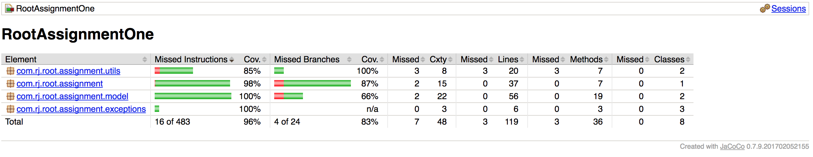

# RootAssignment

Test Coverage

## Approach
Broadly, I decided to approach this problem with the TDD.    
I tried to follow Uncle bob's three rules of TDD whenever I can, which are.

1. You are not allowed to write any production code unless it is to make a failing unit test pass.
2. You are not allowed to write any more of a unit test than is sufficient to fail; and compilation failures are failures.
3. You are not allowed to write any more production code than is sufficient to pass the one failing unit test.

After reading the problem statement I decided to make three classes
- `Console` : Which will act as the interface for user and the business logic.
- `Driver`  : Which represents the Driver and contains the trips for that driver.
- `Trip`    : This is a model class for trip which contains trip related information. 

Then I decided to write a failing test to get the output I require for the given input. 
Starting with `Console` I implemented business logic to get the output.
1. I implemented parser method for user entered command in `parseCommand()` which will throw `UnknownCommandException` if the string does not begin with either `Driver` or `Trip`.
2. `parseCommand()` takes care of entering a `Driver` and `Trip` into a temporary HashMap.
3. A `Driver` will be created using a String as a name. `Trip` associated with the `Driver` can be inserted after fetching the `Driver` from the database.
4. While adding `Trips` all the trips that average a speed of less than 5 mph or greater than 100 mph will be ignored completely. 
5. Once the `Trip` is validated to be inserted into the database, certain attributes are calculated upfront for purposes that will be used while printing the report. Actually calculation of these attributes can be done by iterating over the `List<Trip>` as well, However, selected approach will be better for large data sets.
6. Finally the `printReport()` sorts the database using an util method. Later iterating through each `Driver` we print the pre-calculated values with the help of `toString()` method.    

Using the commit history the same design process can be ensured.

After this, I wrote unit tests for `Driver` and `Trip` to ensure and test the implemented functionality.
Finally added some more corner case tests and ensured all the tests to pass. 

## Why is this done this way? 
1. The reason to go with the HashMap is to get the Driver by his name while entering the Trips associated with him/her.
2. Sorting could have been done using comparator on Driver as well, However this could have resulted in added complexity.     
3. The reason to store the pre-calculated values is to increase the performance with large data sets.
4. As YAGNI, There is no doubt that the solution could have been done by a single model class as Speed. However, this would have indicated a poor object modeling skills. And that was the reason to go with Trip model even though it does not really do much.

## Libraries used
- Joda : For easier date manipulation.
- Jacoco gradle plugin : For the test coverage reports.

## Project Structure
- Source  RootAssignmentOne/src/main/java
- Main Class RootAssignmentOne/src/main/java/com/rj/root/assignment/Console
- Exception RootAssignmentOne/src/main/java/com/rj/root/assignment/exceptions
- Model RootAssignmentOne/src/main/java/com/rj/root/assignment/model
- Util RootAssignmentOne/src/main/java/com/rj/root/assignment/utils
- Tests RootAssignmentOne/src/test/java/com/rj/root/assignment

## How to execute
- To generate jar `gradle assemble`
- To run tests `gradle test`
- To run tests with code coverage `gradle jacocoTestReport`
- To run code `java Console <pathToFile>`

## Assumptions

By below statement, I assume that I should not include trips in the report whose average speed is less than 5 mph or greater than 100 mph. 

> Discard any trips that average a speed of less than 5 mph or greater than 100 mph.
   
